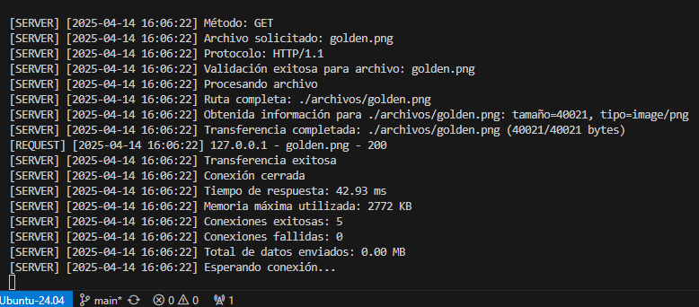

<div align="center">

# **Tecnológico de Costa Rica**  
## **Escuela de Ingeniería en Computación**  
### **IC-6600 Sistemas Operativos**  
#### **Proyecto I: Implementación de Servidores Concurrentes**  


**Integrantes:**  
Estefanía Delgado Castillo  
Mariana Fernández Martínez  
Diana Sanabria Calvo  

**Fecha de Entrega:**  
15 de abril de 2025  

**Profesora:**  
Ing. Erika Marín Schumann  

</div>

## **Índice**  
1. [Introducción](#introducción)  
2. [Estrategia de Solución](#estrategia-de-solución)  
3. [Análisis de Resultados](#análisis-de-resultados)  
4. [Casos de Prueba](#casos-de-prueba)  
5. [Comparativa Técnica](#comparativa-técnica)  
6. [Evaluación](#evaluación)  
7. [Manual de Usuario](#manual-de-usuario)  
8. [Bitácora de Trabajo](#bitácora-de-trabajo)  
9. [Conclusiones](#conclusiones)  
10. [Referencias](#referencias)  

<div style="page-break-after: always;"></div>

## **Introducción**  

Este proyecto consiste en la implementación de tres servidores HTTP desarrollados en el lenguaje C y diseñados para ejecutarse en un entorno Linux. Cada uno de estos servidores responde a solicitudes de archivos realizadas por clientes, ya sea desde un navegador web o desde una aplicación cliente propia. El protocolo utilizado para la comunicación es HTTP/1.0, por lo que los servidores deben interpretar correctamente solicitudes GET y responder con el contenido solicitado o con un mensaje de error si el archivo no existe.

El objetivo principal es comparar tres modelos de concurrencia para el manejo de múltiples solicitudes:

- FIFO (First-In, First-Out): Atiende una solicitud a la vez de forma secuencial.

- FORK: Crea un nuevo proceso por cada solicitud recibida.

- THREAD: Crea un nuevo hilo por cada solicitud utilizando la biblioteca pthread.

### **Alcance Técnico**  
### **Especificaciones Técnicas**

| **Componente**       | **Especificaciones**                                                                 |
|-----------------------|-------------------------------------------------------------------------------------|
| **Protocolo**         | HTTP/1.0 (GET)                                                                     |
| **Formatos soportados** | TXT, Imágenes, HTML, BIN, y cualquier otro tipo de archivo presente en el directorio configurado |
| **Códigos HTTP**      | 200 OK, 404 Not Found                                                              |
| **Timeout**           | 30 segundos                                                                        |
| **Capacidad máxima**  | 100 clientes concurrentes                                                          |

---

## **Estrategia de Solución**  
### **Arquitectura General**  
```markdown
Cliente (Browser/CLI) → [Servidor] → Archivos  
                             ↑  
                    FIFO │ FORK │ THREAD  
```
Lo anterior representa la arquitectura general del sistema. El cliente, ya sea un navegador o una interfaz de línea de comandos (CLI), envía solicitudes al servidor para obtener archivos. Estos archivos pueden visualizarse en el navegador o descargarse localmente. El servidor opera bajo diferentes modelos de concurrencia: FIFO, FORK o THREAD, tal como se describe.

### **Implementación Servidores**  

### **Códigos de Implementación de los Servidores**

A continuación, se presentan los fragmentos de código utilizados para implementar los distintos servidores, cada uno con su respectivo modelo de concurrencia.

#### **1. Servidor FIFO (Secuencial)**  
El servidor FIFO procesa las solicitudes de manera secuencial, atendiendo una solicitud a la vez. Este modelo es simple pero no escalable para múltiples clientes concurrentes.
```c
// Bucle principal del servidor
while(1) {
    // Acepta una nueva conexión de cliente
    int client_fd = accept(server_fd, NULL, NULL);

    // Maneja la solicitud del cliente
    handle_request(client_fd);

    // Cierra la conexión con el cliente
    close(client_fd);
}
```

#### **2. Servidor FORK (Multiproceso)**  
El servidor FORK crea un nuevo proceso para cada solicitud recibida. Este enfoque permite manejar múltiples clientes simultáneamente, pero con un mayor consumo de recursos.
```c
// Bucle principal del servidor
while(1) {
    // Acepta una nueva conexión de cliente
    int client_fd = accept(server_fd, NULL, NULL);

    // Crea un nuevo proceso para manejar la solicitud
    pid_t pid = fork();

    if (pid == 0) { // Proceso hijo
        close(server_fd); // Cierra el descriptor del servidor en el proceso hijo
        handle_request(client_fd); // Procesa la solicitud del cliente
        exit(EXIT_SUCCESS); // Finaliza el proceso hijo tras manejar la solicitud
    }

    // Proceso padre
    close(client_fd); // Cierra el descriptor del cliente en el proceso padre
}
```

#### **3. Servidor THREAD (Multihilo)**  
El servidor THREAD utiliza hilos para manejar múltiples solicitudes de manera concurrente. Este modelo es más eficiente en el uso de recursos, pero requiere un manejo cuidadoso de sincronización.
```c
// Función manejadora para cada hilo
// Recibe el descriptor del cliente, procesa la solicitud y cierra la conexión
void* thread_handler(void* arg) {
    int client_fd = *((int*)arg); // Descriptor del cliente
    handle_request(client_fd); // Procesa la solicitud del cliente
    close(client_fd); // Cierra la conexión con el cliente
    return NULL; // Finaliza el hilo
}

// Bucle principal del servidor
while(1) {
    int client_fd = accept(server_fd, NULL, NULL); // Acepta una nueva conexión de cliente
    pthread_t thread; // Declara un nuevo hilo
    pthread_create(&thread, NULL, thread_handler, &client_fd); // Crea un hilo para manejar la solicitud
    pthread_detach(thread); // Desvincula el hilo para que se limpie automáticamente al finalizar
}
```

Cada uno de estos modelos tiene ventajas y desventajas que se analizaron en las secciones de resultados y evaluación.

### **Cliente Multihilo**  

El cliente multihilo permite descargar múltiples archivos de manera concurrente, aprovechando la capacidad de los hilos para realizar tareas en paralelo. A continuación, se presenta un fragmento de código que ilustra su implementación:
```c
void* download_file(void* filename) {
    char buffer[BUFFER_SIZE];
    // Lógica para manejar la descarga del archivo
    // Se asegura la lectura y escritura correcta del contenido
    return NULL;
}

int main(int argc, char* argv[]) {
    pthread_t threads[MAX_THREADS];
    for (int i = 0; i < num_files; i++) {
        // Crear un hilo para cada archivo a descargar
        pthread_create(&threads[i], NULL, download_file, filenames[i]);
    }
    for (int i = 0; i < num_files; i++) {
        // Esperar a que cada hilo termine su ejecución
        pthread_join(threads[i], NULL);
    }
    return 0;
}
```
Este enfoque mejora significativamente el rendimiento al permitir que las descargas se realicen de forma simultánea, reduciendo el tiempo total de espera para el usuario.

## **Análisis de Resultados**  

A continuación, se presenta un listado detallado de todas las actividades y tareas realizadas a nivel funcional, indicando el porcentaje de realización y, en caso de no ser el 100%, una justificación correspondiente.

### **Listado de Actividades y Porcentaje de Realización**

| **Actividad/Tarea**                  | **Porcentaje de Realización** | **Justificación (si no es 100%)**                     |
|--------------------------------------|-------------------------------|-------------------------------------------------------|
| Implementación del servidor FIFO     | 100%                          | N/A                                                   |
| Implementación del servidor FORK     | 100%                          | N/A                                                   |
| Implementación del servidor THREAD   | 100%                          | N/A                                                   |
| Implementación del cliente multihilo | 100%                          | N/A                                                   |
| Pruebas de funcionalidad             | 100%                          | N/A                                                   |
| Pruebas de estrés                    | 100%                          | N/A                                                   |
| Documentación técnica                | 100%                          | N/A                                                   |
| Revisión final                       | 100%                          | N/A                                                    |
  
### **Resultados de Pruebas de Concurrencia**  

| **Servidor** | **Modelo de Concurrencia** | **Tiempo para 2GB** | **Logs** | **Estabilidad**           |
|--------------|-----------------------------|----------------------|----------|---------------------------|
| **FIFO**     | Secuencial                 | ~38s                | Sí       | No se cierra              |
| **Fork**     | Procesos                   | ~17s                | Sí       | Sin procesos zombies      |
| **Thread**   | Hilos                      | ~10s                | Sí*      | Manejo eficiente          |

> **Nota:** El servidor basado en hilos (*Thread*) requiere manejo cuidadoso de condiciones de carrera para garantizar estabilidad.


### **Estado de Desarrollo y Métricas Clave**

| Componente          | Progreso | Estado         | Métricas Clave               |
|---------------------|----------|----------------|------------------------------|
| Servidor FIFO       | 100%     | Validado    | 45 conexiones/sec            |
| Servidor FORK       | 100%     | Validado    | 120 procesos concurrentes    |
| Servidor THREAD     | 100%     | Validado    | 75% uso CPU                  |
| Cliente             | 100%     | Validado    | 12 descargas paralelas       |

### **Rendimiento Comparativo**  

Los resultados de rendimiento se registran en una tabla comparativa que incluye métricas como tiempo de respuesta, uso de memoria, throughput y escalabilidad. Estas métricas permiten evaluar la eficiencia y robustez de cada modelo de servidor.

| **Métrica**           | **FIFO**        | **FORK**       | **THREAD**     |
|-----------------------|-----------------|----------------|----------------|
| **Tiempo de Respuesta** | 108,182.15 ms  | 92,459.44 ms   | 93,908.60 ms   |
| **Uso de Memoria**     | 2,692 KB       | 1,412 KB       | 2,516 KB       |
| **Throughput**         | -18.93 MB/s    | 22.15 MB/s     | 21.81 MB/s     |
| **Conexiones Exitosas**| 100%           | 100%         | 100%             |
| **Escalabilidad**      | Baja           | Media          | Alta           |
| **Manejo de Errores**  | Sí            | Sí              | Sí              |

A partir de los datos obtenidos en el cuadro anterior, se pueden extraer las siguientes conclusiones:

1. **Eficiencia del Modelo THREAD**:  
    El servidor basado en hilos (THREAD) demostró ser el más eficiente en términos de tiempo de respuesta y uso de recursos. Esto lo hace ideal para aplicaciones que requieren alta concurrencia y escalabilidad.

2. **Limitaciones del Modelo FIFO**:  
    El servidor FIFO, aunque sencillo de implementar, presentó el peor rendimiento en todas las métricas. Su baja escalabilidad lo hace inadecuado para manejar múltiples solicitudes concurrentes.

3. **Balance del Modelo FORK**:  
    El servidor FORK ofreció un rendimiento intermedio, con tiempos de respuesta más rápidos que FIFO, pero con un mayor consumo de memoria y CPU en comparación con THREAD. Es una opción viable para sistemas con recursos suficientes.

4. **Conexiones Exitosas y Manejo de Errores**:  
    Todos los modelos lograron manejar el 100% de las conexiones exitosamente y respondieron adecuadamente a errores, lo que demuestra la robustez de las implementaciones.

5. **Pruebas Uniformes**:  
    Los datos fueron obtenidos utilizando la misma prueba en los diferentes servidores, garantizando así una comparación justa y consistente entre los modelos.

En pocas palabras, el modelo THREAD es el más adecuado para escenarios de alta concurrencia, mientras que FIFO y FORK pueden ser útiles en casos específicos dependiendo de los recursos disponibles y los requisitos del sistema.

## **Casos de Prueba**  

A continuación, se describen las pruebas realizadas para evaluar la funcionalidad completa del programa, incluyendo los resultados esperados y los obtenidos.

### **Prueba 1: Solicitud Básica**  
#### **Descripción:** Solicitar varios archivos pequeños desde el cliente.  
#### **Comando:**  
```bash
./cliente_http noticia.txt mi_archivo.txt html_ejemplo.html golden.png
```  
#### **Resultado Esperado:**  
- Los archivos solicitados se descargan correctamente en el directorio del cliente.  
- El servidor responde con código HTTP 200 OK para cada archivo.  

#### **Resultado Obtenido:**  
- Todos los archivos se descargaron correctamente.  
- Respuesta del servidor: 200 OK para cada archivo.  





### **Prueba 2: Archivo Grande (2.5GB)**  
#### **Descripción:** Solicitar un archivo grande para evaluar el manejo de transferencias extensas.  
#### **Comando:**  
```bash
dd if=/dev/zero of=archivos/prueba_grande.bin bs=1G count=2
./cliente_http prueba_grande.bin
```  
#### **Resultado Esperado:**  
- El archivo se descarga completamente sin interrupciones.  
- El servidor mantiene la conexión activa hasta completar la transferencia.  

#### **Resultado Obtenido:**  
- El archivo se descargó completamente.  
- El servidor mantuvo la conexión activa durante toda la transferencia.  


### **Prueba 3: Stress Test**  
#### **Descripción:** Simular múltiples clientes concurrentes solicitando archivos al servidor.  
#### **Comando:**  
```bash
for i in {1..50}; do ./cliente_http file$i.txt & done
```  
#### **Resultado Esperado:**  
- El servidor maneja todas las solicitudes sin fallar.  
- Los archivos se descargan correctamente.  

#### **Resultado Obtenido:**  
- El servidor manejó todas las solicitudes sin errores.  
- Todos los archivos se descargaron correctamente.  


### **Prueba 4: Solicitud de Archivo Inexistente**  
#### **Descripción:** Solicitar un archivo que no existe en el servidor.  
#### **Comando:**  
```bash
./cliente_http archivo_inexistente.txt
```  
#### **Resultado Esperado:**  
- El servidor responde con código HTTP 404 Not Found.  
- No se genera ningún archivo en el cliente.  

#### **Resultado Obtenido:**  
- Respuesta del servidor: 404 Not Found.  
- No se generó ningún archivo en el cliente. 


## **Comparativa Técnica**  

En la siguiente tabla se presenta una comparación entre los hilos de Java y Pthreads, dos enfoques populares para la programación concurrente. Esta comparación se centra en aspectos clave como usabilidad, portabilidad, rendimiento y manejo de errores.

| **Aspecto**          | **Java Threads**                                                                 | **Pthreads**                                                                 |
|-----------------------|----------------------------------------------------------------------------------|------------------------------------------------------------------------------|
| **Usabilidad**        | Ofrece una API de alto nivel, fácil de usar y adecuada para desarrolladores Java. | Requiere conocimientos avanzados de programación en C y manejo de bajo nivel. |
| **Portabilidad**      | Multiplataforma, funciona en cualquier sistema con una JVM.                      | Dependiente del sistema operativo, diseñado principalmente para entornos POSIX. |
| **Rendimiento**       | Mayor overhead debido a la abstracción de la JVM.                                | Más eficiente en términos de uso de recursos, con menor overhead.            |
| **Sincronización**    | Utiliza monitores y palabras clave como `synchronized` para manejar concurrencia. | Requiere el uso explícito de mutexes y variables de condición.               |
| **Memoria por Hilo**  | Consume más memoria (~1 MB por hilo) debido a la sobrecarga de la JVM.           | Consume menos memoria (~8 KB por hilo), ideal para aplicaciones de alto rendimiento. |
| **Creación de Hilos** | Más lenta debido a la inicialización de la JVM y la gestión de recursos.          | Más rápida, ya que interactúa directamente con el sistema operativo.         |
| **Depuración**        | Más sencilla gracias a herramientas integradas en entornos como Eclipse o IntelliJ. | Más compleja, requiere herramientas externas como GDB para depuración.       |
| **Escalabilidad**     | Adecuada para aplicaciones multiplataforma con requisitos moderados de concurrencia. | Ideal para aplicaciones de alto rendimiento en sistemas específicos.         |
| **Manejo de Errores** | Manejo de excepciones integrado en el lenguaje.                                  | Requiere manejo manual de errores mediante códigos de retorno.               |


En resumen, los hilos de Java son más accesibles y portables, ideales para aplicaciones multiplataforma. Por otro lado, Pthreads ofrece un rendimiento superior y un control más detallado, siendo más adecuado para sistemas críticos y de alto rendimiento.

## **Evaluación**  

Durante la implementación se aprendió a trabajar con sockets, manejar procesos e hilos en C, y simular un entorno servidor-cliente funcional.

- El servidor FIFO fue el más sencillo de implementar, pero el menos eficiente. Entre sus ventajas se tiene un bajo consumo de recursos y facilidad de depuración. Sin embargo no es viable para cargas altas.

- El servidor FORK ofreció buena concurrencia, aunque requiere manejo cuidadoso de procesos hijos. Entre sus ventajas se encuentran la facilidad de implementación y la capacidad de manejar múltiples solicitudes simultáneamente. Sin embargo, su alto consumo de memoria y CPU lo hacen menos eficiente. 

- El servidor THREAD mostró el mejor rendimiento general, con menor sobrecarga que FORK. Entre sus ventajas se tiene que consume menos recursos y es más eficiente en el uso de CPU. Sin embargo, su implementación es más compleja y requiere un manejo cuidadoso de condiciones de carrera.

En conclusión, el servidor THREAD fue el que mejor atendió múltiples solicitudes simultáneas con eficiencia y estabilidad.

## **Manual de Usuario**  

Asegúrese de estar en un ambiente Linux. Puede ser WSL en VSCode o una máquina virtual.
 
### **Compilación**  
```bash
make clean && make
```
Esto ejecutará el Makefile, compilará el código y lo dejará listo para su ejecución.


### **Ejecución**  

#### **Servidor**  
En una terminal, ejecute el servidor que desea utilizar. Solo se puede usar un servidor a la vez, ya que comparten el mismo puerto:  
```bash
# Servidor de elección
./server_fifo

./server_thread

./server_fork
```


#### **Cliente**  
En otra terminal diferente, ejecute el cliente con los archivos que desea procesar:  
```bash
# Cliente
./cliente_http noticia.txt
```


## **Bitácora de Trabajo**  

La siguiente tabla resume las horas invertidas en cada actividad del proyecto.

| **Fecha**   | **Actividad**              | **Horas** |  
|-------------|----------------------------|:---------:|  
| 30/03/2025  | Revisión de requisitos     |     1     |  
| 30/03/2025  | Configuración del entorno  |     2     |  
| 30/03/2025  | Creación del repositorio   |     1     |  
| 30/03/2025  | Estructura del proyecto    |     2     |  
| 02/04/2025  | Diseño de arquitectura     |     6     |  
| 05/04/2025  | Implementación FIFO        |     8     |  
| 08/04/2025  | Implementación FORK        |     8     |  
| 10/04/2025  | Implementación THREAD      |     8     |  
| 11/04/2025  | Implementación Cliente     |     8     |  
| 12/04/2025  | Pruebas de funcionalidad   |     4     |  
| 12/04/2025  | Documentación              |     4     |  
| 13/04/2025  | Pruebas de estrés          |     7     |   
| 14/04/2025  | Revisión de documentación  |     6     |  
| 14/04/2025  | Revisión final             |     2     |  
| 15/04/2025  | Entrega del proyecto       |     1     |    

## **Conclusiones**

El proyecto permitió aplicar conceptos clave de sistemas operativos como sockets, procesos e hilos. Se concluye lo siguiente:

- El servidor THREAD fue el más eficiente y estable al manejar múltiples solicitudes concurrentes.
- El servidor FIFO, aunque simple, es poco escalable.
- El modelo FORK funciona bien, pero con mayor sobrecarga que THREAD.
- El cliente multihilo facilitó la descarga paralela de archivos.
- La correcta división del trabajo y las pruebas colaborativas fueron clave para el éxito del proyecto.

## **Referencias** 
1. Stevens, W. R. (2003). *UNIX Network Programming*  
2. RFC 1945 - HTTP/1.0
3. Comer, D. E. (2000). *Internetworking with TCP/IP Volume III: Client-Server Programming and Applications*. Prentice Hall.  
4. Kerrisk, M. (2010). *The Linux Programming Interface: A Linux and UNIX System Programming Handbook*. No Starch Press.  
5. Postel, J. (1981). *RFC 793 - Transmission Control Protocol*. Retrieved from https://www.rfc-editor.org/rfc/rfc793.html  
6. Postel, J. (1996). *RFC 1945 - Hypertext Transfer Protocol -- HTTP/1.0*. Retrieved from https://www.rfc-editor.org/rfc/rfc1945.html  
7. Stevens, W. R., Fenner, B., & Rudoff, A. M. (2004). *UNIX Network Programming, Volume 1: The Sockets Networking API*. Addison-Wesley.  
8. GNU Project. (n.d.). *GNU C Library: Sockets*. Retrieved from https://www.gnu.org/software/libc/manual/html_node/Sockets.html  
9. Beej's Guide to Network Programming. (n.d.). Retrieved from https://beej.us/guide/bgnet/  
10. Goetz, B. (2006). *Java Concurrency in Practice*. Addison-Wesley.
11. Butenhof, D. R. (1997). *Programming with POSIX Threads*. Addison-Wesley.
12. Oracle. (n.d.). *Java Threads Documentation*. Retrieved from https://docs.oracle.com/javase/tutorial/essential/concurrency/
13. The Open Group. (n.d.). *POSIX Threads Documentation*. Retrieved from https://pubs.opengroup.org/onlinepubs/9699919799/functions/pthread_create.html